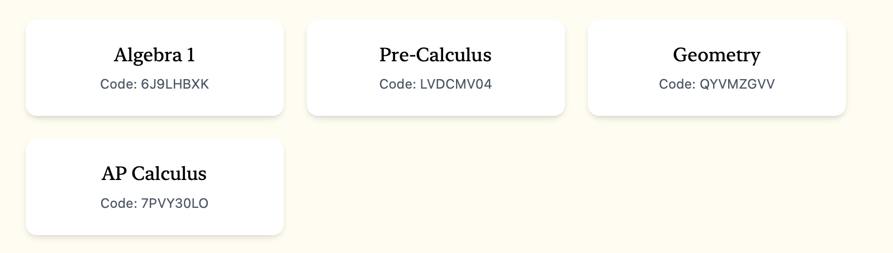

# Bloom

Bloom is a modern, open-source educational platform designed to help teachers create interactive quizzes and track student progress. Students can answer questions and receive real-time feedback on their learning performance.

## Live Build
Want to try out Bloom? A live build is available at [https://bloomlms.netlify.app](https://bloomlms.netlify.app) with Netlify for frontend and Render for backend. You can join an example class with an example lesson by creating a student account and joining with class code "Z0QB23JK".

## Features

**For Teachers:**
- Create, edit, and delete classes, lessons and questions  
- View students’ progress and scores  
- Preview quizzes as students  

**For Students:**
- Participate in lessons and quizzes  
- Track personal progress and scores  
- View a summary report at the end of quizzes  

## Demo Screenshots

### Dashboard with list of classes

### Class page showing users and lessons

### Quiz page with a question and answer choices

---

## Tech Stack

- **Frontend:** React, Tailwind CSS, Vite  
- **Backend:** Python, Strawberry GraphQL, SQLModel, SQLite  
- **Authentication:** Google OAuth  

## Contact

With any questions, suggestions, or feedback, out:

- **Email:** [samgreenfield0@gmail.com](mailto:samgreenfield0@gmail.com)  
- **Source Code:** [GitHub Repository](https://github.com/samgreenfield/Bloom)
